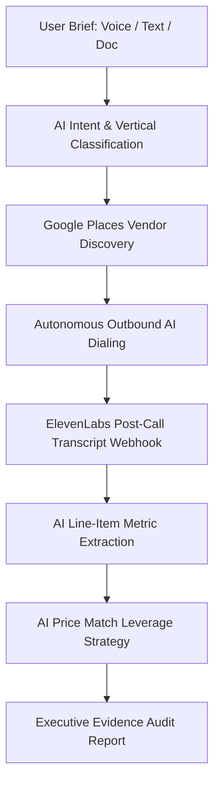

# Negotiator AI


> **Autonomous AI Procurement & Price Negotiation Agent** Built for the OpenAI Hackathon.
>
> Negotiator AI delegates your vendor outreach, price comparisons, and rate negotiations to AI. Describe your service scope or attach a quote; our autonomous agent discovers local service providers via Google Places, places real conversational phone calls with ElevenLabs AI, extracts itemized pricing, and negotiates binding deals using AI leverage strategies.

---

## The problem

Getting a fair price should not require becoming a part-time procurement specialist. Yet hiring a contractor, buying a laptop, planning a wedding, or sourcing a business service often means chasing vendors, repeating the same brief, comparing vague totals, and hoping the lowest number does not hide the most expensive surprise.

**Negotiator AI is a voice-first procurement agent that turns that messy process into one auditable workflow:** discover relevant local businesses, call approved contacts, turn spoken answers into comparable quotes, and use verified pricing as negotiation leverage.

## What we built

A user can describe a need by voice or upload an existing quote, invoice, PDF, or PNG. Negotiator AI then:

1. **Builds one locked brief** - captures the requirements that every vendor should receive so the comparison stays fair.
2. **Discovers local options** - searches Google Places for nearby businesses, including address, rating, maps link, and business phone data.
3. **Runs live outbound conversations** - uses ElevenLabs Conversational AI and Twilio to contact approved, consented demo participants for a real phone-call experience.
4. **Tracks real call outcomes** - distinguishes calling, processing a completed call, no answer, a documented decline, and a quote received.
5. **Creates evidence-backed quote records** - extracts only amounts explicitly spoken in the transcript, flags missing terms, and keeps the transcript beside the resulting quote.
6. **Finds negotiation leverage** - selects the lowest comparable verified quote and uses it to request a price match or measurable added value from the higher-priced vendor.
7. **Produces an executive comparison** - presents line items, totals, terms, red flags, and savings in one decision-ready report.

For the live demo, calls are deliberately limited to three verified, consented participants. That keeps the experience safe and testable while showing the same orchestration pattern a production, user-approved vendor-calling workflow would use.

## Why Codex and GPT-5.6 mattered

Codex was not a one-time autocomplete tool for this project. It was the engineering partner that let us turn a deceptively simple idea - “call multiple vendors and compare prices” - into a real, failure-aware system.

Using Codex with GPT-5.6, we designed and implemented:

- the Next.js App Router API surface for discovery, call initiation, call status, webhooks, negotiation, and reporting;
- the TypeScript domain model that preserves a locked job brief, call state, transcript, quote, leverage, and audit output;
- the event-driven call lifecycle that reconciles Twilio telephony state with ElevenLabs post-call transcripts;
- durable cross-instance call storage for serverless deployment, so a webhook can update the same call that initiated in a different function instance;
- guardrails that prevent invented prices: quotes only use values stated in the source transcript, and incomplete calls remain declines rather than fabricated estimates;
- the responsive six-vendor discovery and three-call experience, including explicit **Not picked up** and **Processing quote** states.

GPT-5.6 was especially valuable for reasoning across these connected constraints: asynchronous webhooks, serverless persistence, telephony failure states, and a UI that must remain honest when a vendor does not answer or a transcript is delayed. Codex accelerated implementation, but every workflow was reviewed, tested, and shaped around the real system behavior.

## How we built it

- **Product and frontend:** Next.js 16, React 19, TypeScript, Tailwind CSS
- **Voice and telephony:** ElevenLabs Conversational AI and Twilio outbound calling
- **Discovery:** Google Places API (New Text Search)
- **Quote intelligence:** structured transcript normalization with evidence constraints
- **Reporting:** GPT 5.6-generated executive report from the collected quote and negotiation data
- **Reliability:** Redis-compatible durable state for webhooks and serverless status polling

## The hard parts

### Voice calls do not end when the UI thinks they do

A phone can ring forever, go unanswered, be cut short, or finish while its transcript is still being processed. We had to model those states separately. The interface now stops pretending every call is active: Twilio status reconciliation surfaces **Not picked up** and **Processing quote**, while the transcript webhook supplies the final evidence.

### “A price” is not a comparable quote

A vendor saying one number is not enough. We needed scope, fees, validity, binding terms, and exclusions. The system treats absent details as absent details. It does not fill the gap with an AI guess.

### Serverless webhooks need durable memory

An outbound call can begin in one Vercel function and finish in another. In-memory state loses that connection. We added durable call records keyed by the internal call ID and provider conversation identifiers so callbacks can recover the right quote workflow.

## What we learned

The most exciting lesson was that useful agents are not just chat interfaces with a phone number. They need a trustworthy state machine, evidence boundaries, graceful failure handling, and a product experience that explains uncertainty instead of hiding it.

Negotiator AI is our answer to a practical question: **what if everyone had a procurement officer that could do the calling, keep the receipts, and still let the human make the final decision?**

---

## ⚡ Workflow & Architecture



1. **Intake (`/`)**: Voice conversation via `InlineVoicePrompt` or document upload (`/api/intake/parse-document`).
2. **Autonomous Stream (`/agent-run`)**: Orchestrates classification, discovery, outbound dialing, metric extraction, leverage calculation, and report generation in a unified stream.
3. **Call Execution (`/calls`)**: Manages batch outbound calls, live audio waveforms, and transcript displays.
4. **Negotiation (`/negotiate`)**: Surfaces calculated price-match leverage strategy, target vs. benchmark quotes, and potential savings.
5. **Executive Report (`/report`)**: Renders audited quote comparisons, verified binding badges, line-item breakdowns, and PDF/export tools.

---

## 🌐 Routes Overview

| Route | Purpose |
| --- | --- |
| `/` | Product landing page with in-place voice assistant & text input. |
| `/agent-run` | End-to-end autonomous agent execution stream. |
| `/discover` | Vendor discovery results powered by Google Places API. |
| `/calls` | Outbound AI call batch manager with live audio spectrum visualizers. |
| `/negotiate` | AI price-matching leverage strategy and savings tracker. |
| `/report` | Cryptographically verified executive quote audit report. |

---

## 🛠️ API Endpoints

| Endpoint | Method | Description |
| --- | --- | --- |
| `/api/verticals/classify` | `POST` | Classifies user prompt into service vertical schemas. |
| `/api/discovery/google-places` | `POST` | Discovers local service providers via Google Places API. |
| `/api/calls/initiate` | `POST` | Starts ElevenLabs outbound AI phone call to vendor. |
| `/api/calls/[id]/status` | `GET` | Returns status, quote, and transcript for an active call. |
| `/api/webhooks/elevenlabs` | `POST` | Webhook for post-call transcripts; extracts itemized quote data. |
| `/api/negotiate` | `POST` | Computes AI price match strategy between quotes. |
| `/api/report/generate` | `POST` | Generates evidence-backed executive audit report. |

---

## 💻 Local Setup & Installation

### Prerequisites
- Node.js 18.17+
- npm

### Installation Steps

1. **Clone Repository & Install Dependencies**:
   ```bash
   git clone https://github.com/gargieesingh/NegotiatorAI.git
   cd NegotiatorAI
   npm install
   ```

2. **Configure Environment Variables**:
   Copy `.env.local.example` to `.env.local` and supply your API keys:
   ```bash
   cp .env.local.example .env.local
   ```

   Required environment variables:
   ```env
   ELEVENLABS_API_KEY=your_elevenlabs_api_key
   ELEVENLABS_INTAKE_AGENT_ID=your_intake_agent_id
   NEXT_PUBLIC_ELEVENLABS_INTAKE_AGENT_ID=your_intake_agent_id
   ELEVENLABS_NEGOTIATOR_AGENT_ID=your_negotiator_agent_id
   ELEVENLABS_OUTBOUND_PHONE_NUMBER_ID=your_phone_number_id
   GOOGLE_PLACES_API_KEY=your_google_places_api_key
   OPENAI_API_KEY=your_openai_api_key
   ```

3. **Run Development Server**:
   ```bash
   npm run dev
   ```
   Open [http://localhost:3000](http://localhost:3000) in your browser.

4. **Production Build**:
   ```bash
   npm run build
   ```

---

## 🧪 Testing Path for Judges

1. **Voice / Text Intake**: On `http://localhost:3000`, click **Voice Agent** to start a real-time voice briefing, or type a request like *"I need 3 contractor quotes for AC repair in Lucknow"* and click **Run Agent**.
2. **Autonomous Stream**: Watch `/agent-run` classify your vertical, discover local vendors via Google Places, place outbound calls, extract metrics, and generate leverage strategies automatically.
3. **Review Results & Reports**: Inspect `/calls` for live audio waveforms & transcripts, `/negotiate` for price match calculations, and `/report` for the final executive evidence audit report.

---

## 🛡️ License & Disclaimers
- Verified phone calls placed during demos use consented test numbers.
- Quotes and estimates generated by Negotiator AI are based on transcript data and should be verified directly with vendors before signing binding contracts.
