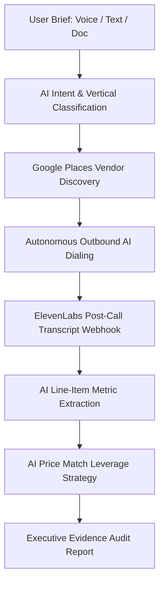

# Negotiator AI

> **Autonomous AI Procurement & Price Negotiation Agent** — Built for the OpenAI Hackathon.
>
> Negotiator AI delegates your vendor outreach, price comparisons, and rate negotiations to AI. Describe your service scope or attach a quote; our autonomous agent discovers local service providers via Google Places, places real conversational phone calls with ElevenLabs AI, extracts itemized pricing, and negotiates binding deals using AI leverage strategies.

---

## 🌟 Elevator Pitch (Devpost)

**Negotiator AI is an autonomous agent that discovers local vendors, places live conversational phone calls, extracts itemized quotes, and negotiates binding price discounts using AI leverage strategies.**

---

## 📖 Project Story

### 💡 Inspiration
Negotiating prices for home repairs, contractors, wedding vendors, caterers, or commercial services is tedious and time-consuming. Consumers and business owners waste hours making manual phone calls, dealing with hidden fees, and struggling to negotiate fair rates. We wanted to build an autonomous agent that acts as a 24/7 personal procurement officer—handling everything from vendor discovery to live phone negotiation and executive audit reporting.

### 🤖 What it Does
1. **Voice & Document Briefing**: Users state what they need using a real-time conversational voice assistant (ElevenLabs) or by uploading an existing quote/invoice (PDF/PNG).
2. **AI Vertical Classification & Normalization**: The agent automatically classifies the job type, extracts scope parameters, and generates vertical-specific quote line-item rules using fast AI models (GPT-5.6 / Cerebras / Claude).
3. **Real Market Discovery**: Queries the Google Places API to discover verified local service providers with ratings, locations, and contact info.
4. **Autonomous Outbound AI Calls**: Initiates real outbound phone calls to vendors using ElevenLabs Conversational Voice AI and Twilio telephony integration.
5. **Itemized Quote & Metric Extraction**: Webhooks process post-call audio transcripts, extracting itemized line items (base fee, taxes, mandatory add-ons, binding terms, red flags) with strict transcript turn citations (Zero Invented Data Policy).
6. **AI Leverage Negotiation**: Formulates non-hallucinating price-match negotiation strategies using verified benchmark quotes against target vendors.
7. **Executive Audit & Evidence Report**: Produces a cryptographically hashed audit report containing line-item comparison tables, savings breakdowns, and top recommendations.

### 🛠️ How We Built It
- **Frontend & Design System**: Next.js 16 (App Router, Turbopack), React 19, Tailwind CSS v4, styled after the **NeuraTalk Design Language** (clean Satoshi/Inter typography, soft white cards, sleek micro-animations).
- **Voice & Telephony**: ElevenLabs Conversational Voice AI (WebRTC & Outbound Telephony API) + Twilio Webhooks.
- **Vendor Discovery**: Google Places API (New Text Search & Details API).
- **AI Intelligence & Orchestration**: OpenAI GPT-5.6 / Codex / Cerebras AI for classification, quote normalization, and strategy calculation; Claude for executive report generation.

### 🧠 How Codex & GPT-5.6 Were Used
- **Intake Normalization & Intent Classification**: GPT-5.6 / Codex models classify incoming voice & text briefs into structured JSON schemas and map user intent into vertical configurations.
- **Non-Hallucinating Leverage Strategy**: Used GPT-5.6 to compute price match leverage by selecting the lowest verified binding quote as leverage against target vendors, strictly citing transcript evidence.
- **Code Generation & Architecture**: OpenAI Codex was used extensively throughout development to scaffold Next.js App Router API endpoints, write TypeScript type definitions, and implement real-time WebRTC audio visualizer hooks.

### 🚧 Challenges We Faced
- **Real-Time WebRTC In-Place Voice UI**: Transforming standard text prompts into full-screen fluid voice assistant interfaces (similar to Gemini Live / ChatGPT Advanced Voice) without breaking React state cycles.
- **Verifiable Price Extraction**: Ensuring the AI extracts only explicit numerical prices mentioned in call transcripts while flagging non-binding quotes or missing terms.
- **Post-Call Telephony Status Synchronization**: Reconciling Twilio call status callbacks with ElevenLabs post-call transcript webhooks to provide real-time UI card updates.

---

## ⚡ Workflow & Architecture



1. **Intake (`/`)**: Voice conversation via `InlineVoicePrompt` or document upload (`/api/intake/parse-document`).
2. **Autonomous Stream (`/agent-run`)**: Orchestrates classification, discovery, outbound dialing, metric extraction, leverage calculation, and report generation in a unified stream.
3. **Call Execution (`/calls`)**: Manages batch outbound calls, live audio waveforms, and transcript displays.
4. **Negotiation (`/negotiate`)**: Surfaces calculated price-match leverage strategy, target vs. benchmark quotes, and potential savings.
5. **Executive Report (`/report`)**: Renders audited quote comparisons, verified binding badges, line-item breakdowns, and PDF/export tools.

---

## 🌐 Routes Overview

| Route | Purpose |
| --- | --- |
| `/` | Product landing page with in-place voice assistant & text input. |
| `/agent-run` | End-to-end autonomous agent execution stream. |
| `/discover` | Vendor discovery results powered by Google Places API. |
| `/calls` | Outbound AI call batch manager with live audio spectrum visualizers. |
| `/negotiate` | AI price-matching leverage strategy and savings tracker. |
| `/report` | Cryptographically verified executive quote audit report. |

---

## 🛠️ API Endpoints

| Endpoint | Method | Description |
| --- | --- | --- |
| `/api/verticals/classify` | `POST` | Classifies user prompt into service vertical schemas. |
| `/api/discovery/google-places` | `POST` | Discovers local service providers via Google Places API. |
| `/api/calls/initiate` | `POST` | Starts ElevenLabs outbound AI phone call to vendor. |
| `/api/calls/[id]/status` | `GET` | Returns status, quote, and transcript for an active call. |
| `/api/webhooks/elevenlabs` | `POST` | Webhook for post-call transcripts; extracts itemized quote data. |
| `/api/negotiate` | `POST` | Computes AI price match strategy between quotes. |
| `/api/report/generate` | `POST` | Generates evidence-backed executive audit report. |

---

## 💻 Local Setup & Installation

### Prerequisites
- Node.js 18.17+
- npm

### Installation Steps

1. **Clone Repository & Install Dependencies**:
   ```bash
   git clone https://github.com/gargieesingh/NegotiatorAI.git
   cd NegotiatorAI
   npm install
   ```

2. **Configure Environment Variables**:
   Copy `.env.local.example` to `.env.local` and supply your API keys:
   ```bash
   cp .env.local.example .env.local
   ```

   Required environment variables:
   ```env
   ELEVENLABS_API_KEY=your_elevenlabs_api_key
   ELEVENLABS_INTAKE_AGENT_ID=your_intake_agent_id
   NEXT_PUBLIC_ELEVENLABS_INTAKE_AGENT_ID=your_intake_agent_id
   ELEVENLABS_NEGOTIATOR_AGENT_ID=your_negotiator_agent_id
   ELEVENLABS_OUTBOUND_PHONE_NUMBER_ID=your_phone_number_id
   GOOGLE_PLACES_API_KEY=your_google_places_api_key
   CEREBRAS_API_KEY=your_cerebras_api_key
   ANTHROPIC_API_KEY=your_anthropic_api_key
   ```

3. **Run Development Server**:
   ```bash
   npm run dev
   ```
   Open [http://localhost:3000](http://localhost:3000) in your browser.

4. **Production Build**:
   ```bash
   npm run build
   ```

---

## 🧪 Testing Path for Judges

1. **Voice / Text Intake**: On `http://localhost:3000`, click **Voice Agent** to start a real-time voice briefing, or type a request like *"I need 3 contractor quotes for AC repair in Lucknow"* and click **Run Agent**.
2. **Autonomous Stream**: Watch `/agent-run` classify your vertical, discover local vendors via Google Places, place outbound calls, extract metrics, and generate leverage strategies automatically.
3. **Review Results & Reports**: Inspect `/calls` for live audio waveforms & transcripts, `/negotiate` for price match calculations, and `/report` for the final executive evidence audit report.

---

## 🛡️ License & Disclaimers
- Verified phone calls placed during demos use consented test numbers (`+919335845905`, `+917004403310`, `+919955059125`).
- Quotes and estimates generated by Negotiator AI are based on transcript data and should be verified directly with vendors before signing binding contracts.
